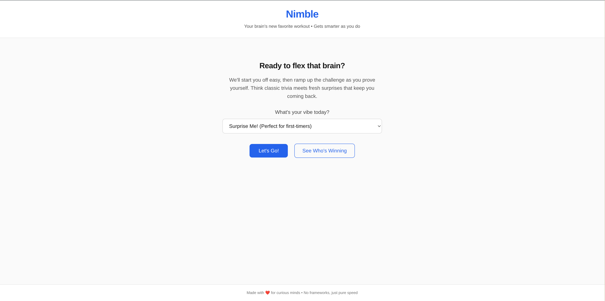

# Nimble

Your brain's new favorite workout! A quiz game that actually gets smarter as you do, with encouraging feedback that makes learning feel like winning.



## Table of Contents

- [Description](#description)
- [Features](#features)
- [Technologies Used](#technologies-used)
- [Getting Started](#getting-started)
- [Usage](#usage)
- [Game Modes](#game-modes)
- [API Integration](#api-integration)
- [Testing](#testing)
- [Deployment](#deployment)
- [Contact](#contact)

## Description

Nimble is an adaptive quiz game that learns from your performance and adjusts difficulty in real-time. Built with pure vanilla web technologies, it demonstrates clean, hand-coded development practices while delivering an engaging learning experience. The game fetches fresh questions from external APIs and provides personalized feedback that makes every session feel rewarding.

What makes Nimble special? It's not just another quiz app - it's a brain training companion that celebrates your progress, learns your strengths, and gently challenges you to grow. No frameworks, no bloat, just smart code that works beautifully.

## Features

- **External API Integration**: Fresh questions from Open Trivia Database across multiple categories
- **Multiple Categories**: Mixed knowledge, science, history, geography, sports, and entertainment
- **Speed Bonuses**: Lightning-fast correct answers earn extra points (up to +50 bonus!)
- **Smart Timing**: Variable question timers based on complexity and difficulty
- **Progress Tracking**: Visual indicators and performance analytics
- **Responsive Design**: Works seamlessly on desktop, tablet, and mobile devices
- **Zero Dependencies**: Pure vanilla JavaScript - no frameworks, maximum performance

## Technologies Used

- **HTML5** - Semantic markup with proper ARIA labels and progressive enhancement
- **CSS3** - Hand-coded styling with CSS Grid, Flexbox, and custom properties
- **JavaScript (Vanilla)** - ES6+ features with async/await for API integration
- **External API** - Open Trivia Database for dynamic question loading

## Getting Started

To get your brain workout up and running, follow these simple steps:

### Prerequisites

You need a modern web browser with JavaScript enabled. That's it!

### Installation

1. Clone the repo
   ```bash
   git clone https://github.com/dhh_elijah/Web3Bridge-Web-Pre-Qualification-Test.git
   ```

2. Navigate to the project directory
   ```bash
   cd Web3Bridge-Web-Pre-Qualification-Test
   ```

## Usage

### Starting Your Brain Workout

1. **Pick Your Vibe**: 
   - Choose "Surprise Me!" for the full adaptive experience with mixed questions
   - Select "Science & Nature" for mind-expanding scientific facts
   - Pick "History" for time travel through important events
   - Try "Geography" for world exploration adventures

2. **Hit "Let's Go!"**: 
   - Jump right into your personalized challenge
   - The game starts easy and ramps up based on your performance

3. **Answer & Learn**:
   - Click your answer or use keyboard shortcuts (1-4 keys)
   - Hit "Lock It In" when you're confident
   - Read the explanation and celebrate your progress!

### Game Controls

- **Answer Selection**: Click options or use number keys (1-4)
- **Submit Answer**: Click "Lock It In" or press Enter
- **Next Question**: Click "Keep Going!" or press Space
- **Skip Question**: Click "I'll Pass" if you're stuck
- **Keyboard Navigation**: Full Tab support for accessibility

### Game Modes

#### Surprise Me! (Mixed Knowledge)
- Random questions from all categories
- Perfect for first-timers and variety seekers
- Adaptive difficulty keeps you in the sweet spot of challenge

#### Category-Specific Modes
- **Science & Nature**: Mind-expanding scientific discoveries
- **History**: Journey through time and important events  
- **Geography**: Explore our amazing planet
- **Sports**: Athletic achievements and records
- **Entertainment**: Pop culture and media fun
- **General Knowledge**: Classic trivia fundamentals

### Scoring & Performance

- **Correct Answer**: +1 point base score
- **Speed Bonus**: Up to +50 points for lightning-fast responses
- **Adaptive Rating**: Your performance influences future question difficulty
- **Encouraging Feedback**: Personalized messages that celebrate progress

## API Integration

Nimble uses the Open Trivia Database API to provide fresh, varied questions:

### Features
- **Real-time Loading**: Questions fetched dynamically for maximum variety
- **Smart Caching**: Optimized performance with intelligent data management
- **Error Handling**: Graceful fallbacks for network issues
- **Data Transformation**: API responses converted to our friendly format

### Categories Available
- General Knowledge (ID: 9)
- Science & Nature (ID: 17) 
- History (ID: 23)
- Geography (ID: 22)
- Sports (ID: 21)
- Entertainment (ID: 11)

## Contact

**Elijah Adebayo** - Full-Stack Developer

**Email** - olusegunvicky121@gmail.com

**GitHub** - [lushegtech](https://github.com/lushegtech)

Project Link: [https://github.com/lushegtech/Web3Bridge-Web3-Pre-Qualification-Test](https://github.com/lushegtech/Web3Bridge-Web3-Pre-Qualification-Test)

Live Demo: [https://lushegtech.github.io/Web3Bridge-Web3-Pre-Qualification-Test/](https://lushegtech.github.io/Web3Bridge-Web3-Pre-Qualification-Test/)

---

*Built with vanilla web technologies and a lot of ❤️. No frameworks, no build process, just clean code that makes learning feel like winning.*